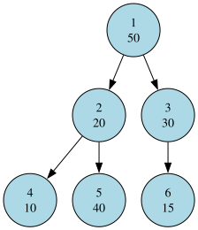



## Prerequisites

You should be comfortable with trees and dynamic programming (DP).

## Understanding the problem

We have been given that there are $N$ employees in a company.
All of them have been given an integer amount of wealth.
Everyone except the head of the company has one manager.
This forms a rooted tree, where the root is the head (Mr Hojo).
$A$ is a subordinate of $B$ if $A$ appears in the subtree rooted at $B$.
We need to find employees $i$ and $j$,
so that the difference between the wealth of $i$ and $j$ is maximum.
As input, we receive an integer $N$.
This is followed by a line containing the managers of each employee.
This is called as array $P$.
The next line provides the wealth of each employee.
This is array $a$ in the problem.

## Main idea

Consider the subtree rooted at a fixed vertex $i$.
We need to find $j$ such that $a[i] - a[j]$ is maximum.
Now if $a[i]$ is fixed, only $a[j]$ varies.
We need to find the minimum possible $a[j]$ for each $i$,
in order to maximize $a[i] - a[j]$.
Let $dp[i]$ be the minimum wealth of any employee in the subtree rooted at $i$.
We maintain these values for each vertex $i$.

To get such a candidate, we use dynamic programming (DP).
Each candidate represents the minimum wealth possible in each subtree.
Now the minimum wealth of a vertex could only come from either itself,
or from one of the subtrees of its children.
In particular, $dp[v]$ is the minimum of $a[v]$ and the
$dp$ values of all of its children.

Hence, while running a depth first search (DFS) algorithm,
we can compute the values while traversing upwards.
During the DFS, we first visit all the children of a vertex
and compute their $dp$ values. We use these values to compute
the $dp$ value of the current vertex.
We now have an array of length $N$ which has the candidates for each vertex.
Then we only need to find the maximum value of $a[i] - dp[i]$ over all $i$.
The time complexity of this algorithm is $\mathcal{O}(n)$.
The space complexity of this algorithm is also $\mathcal{O}(n)$.

## Worked example

Consider the following input:
```text
6
1 1 2 2 3
50 20 30 10 40 15
```

The given input is described by the following image:



In the DFS traversal we first traverse $1$, then $2$ and $4$.
The wealth of the employee $4$ is $10$.
$4$ has no children, and so $dp[4] = a[4] = 10$ by definition.
We now go to vertex $5$. Like vertex $4$, $dp[5] = a[5] = 40$.
We can now compute $dp[2]$.
$$dp[2] = \min(a[2], dp[4], dp[5]) = \min(20, 10, 40) = 10$$
Now we backtrack to vertex $1$ in the DFS process.
We then go down to vertex $3$ and then $6$.
As $6$ has no children, $dp[6] = a[6] = 15$.
Now $dp[3] = \min(a[3], dp[6]) = \min(30, 15) = 15$.
Finally we compute $dp[1]$.
$$dp[1] = \min(a[1], dp[2], dp[3]) = \min(50, 10, 15) = 10$$
Hence $dp[1]$ is the minimum possible wealth of any employee, just as expected.
We now summarize the values computed in a table.

| Vertex number | a  | dp | a - dp |
|---------------|----|----|--------|
| 1             | 50 | 10 | 40     |
| 2             | 20 | 10 | 10     |
| 3             | 30 | 15 | 15     |
| 4             | 10 | 10 | 0      |
| 5             | 40 | 40 | 0      |
| 6             | 15 | 15 | 0      |

Now we need to just find the maximum possible value of $a[i] - dp[i]$
for all values of $i$. From the above table, we see that the answer is $40$.

## Implementation

This is my implementation of this problem:

```cpp title="solution.cpp"
#include <bits/stdc++.h>
using namespace std;

vector<vector<int>> adj;
vector<int> a, dp;

void dfs(int v) {
  dp[v] = a[v];

  for (int u : adj[v]) {
    dfs(u);
    dp[v] = min(dp[v], dp[u]);
  }
}

int main() {
  ios::sync_with_stdio(false);
  cin.tie(nullptr);

  int n;
  cin >> n;

  a.resize(n + 1);
  for (int i = 1; i <= n; i++) {
    cin >> a[i];
  }

  adj.resize(n + 1);
  int root = 0;

  for (int i = 1; i <= n; i++) {
    int p;
    cin >> p;

    if (p == -1) {
      root = i;
    } else {
      adj[p].push_back(i);
    }
  }

  dp.resize(n + 1);

  dfs(root);

  int ans = 0;
  for (int i = 1; i <= n; i++) {
    ans = max(ans, a[i] - dp[i]);
  }

  cout << ans << '\n';

  return 0;
}
```
