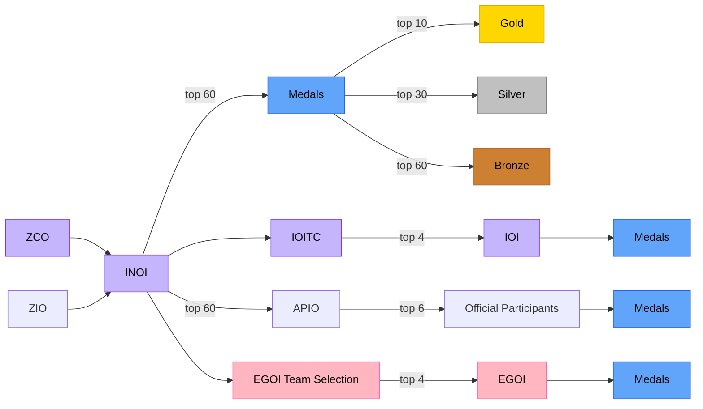

## Roadmap

Olympiad preparation is not easy, and is definitely time consuming. For some steps, I'll also include a 'recommended time to spend' so you have some sort of guideline to follow.

- [Introduction]()
- Learn C++ *(1 week)*:
  - [YouTube video (recommended)](https://youtu.be/vLnPwxZdW4Y?si=hVGOly7HbHpkcrjX)
  - [Or if you prefer something structured as a course](https://learncpp.online/lessons): this may go into additional unrequired depth, for example the information about build systems is unnecessary for competitive programming
  - (optional) After you've learned the language, if you still have time left over, play around with the language (make mini projects). This will *really* help you get comfortable.
    - (more optional) I'd recommend learning the following features specifically
      - some STL algorithms like `std::sort` and `std::find`
        - we'll learn specifically useful ones as we progress
      - `class/struct` 
      - `template <typename T>`
- [Built-in data structures]()
- [Linear search]()
- [Basic implementation]()

---

Our main strategy will be to use [CSES](https://cses.fi) along with [AtCoder](https://atcoder.jp) (here, we'll be giving AtCoder beginner contests). You can also give contests on [Codeforces](https://codeforces.com), but we believe that modern-day Codeforces is not as relevant to OI as AtCoder is, **especially in the earlier stages**.

Note that most CSES solutions can be found in [CPH](https://cses.fi/book/book.pdf) (although this book describes some solutions a bit too concisely, sometimes not enough to learn a concept).

- [AtCoder](https://atcoder.jp/): beginner contests are held every Saturday at 5:30 IST. You should participate in all of them and aim to get A-D for ZCO and A-F for INOI.
- [Static range queries]()
- [Constructive algorithms]()
- [Greedy algorithms]()
- [Binary search]()

---

- Dynamic programming
  - Solve problems from the [AtCoder DP Contest](https://atcoder.jp/contests/dp/tasks)
  - Also solve problems from the CSES 'Dynamic Programming' section.
  - In general, [this playlist](https://www.youtube.com/playlist?list=PLb3g_Z8nEv1h1w6MI8vNMuL_wrI0FtqE7) is pretty good for solutions for CSES.
    - You should try solving a problem, and if you can't, watch the solution.
- [Graphs]()
  - Almost all problems from the CSES 'Graph Algorithms' section are relevant. You can probably skip these ones though:
    - [Giant Pizza](https://cses.fi/problemset/task/1684): uses 2-SAT
    - [Mail Delivery](https://cses.fi/problemset/task/1691), [De Bruijn Sequence
](https://cses.fi/problemset/task/1692), and [Teleporters Path
](https://cses.fi/problemset/task/1693): use the concept of an Eulerian tour/path
    - And you can probably skip the last 4 problems (they use flows), although the newer IOI syllabus does now include them

---

- [Segment trees](https://en.algorithmica.org/hpc/data-structures/segment-trees/)
  - This article also covers Fenwick trees, which you could also learn. They are easier to code, but much harder conceptually to understand
  - [This SPOI lecture](https://youtu.be/lmyEAqTski8?si=d1DUVRz2LQATVs4m) also covers segment trees
  - Solve problems from the CSES 'Range Queries' section
- Disjoint set union:
  - Here's [an SPOI lecture](https://youtu.be/XYGht1BeAdo?si=pfXJ1nzPYyQ_YLiU) that covers this, go to ~1:42:00
  - If you prefer a text resource, you can use [this](https://cp-algorithms.com/data_structures/disjoint_set_union.html)
- [Sparse tables](https://youtu.be/0jWeUdxrGm4?si=EuZDchCjH7pYj51v): closely related to binary lifting

---

- Trees
  - The CSES 'Tree Algorithms' section has relevant problems
    - You should be able to skip [Path Queries II](https://cses.fi/problemset/task/2134) if you're only preparing for ZCO (this problem uses a technique called heavy-light decomposition); all other problems are relevant
  - Lowest common ancestor
    - [YouTube video by Errichto](https://youtu.be/dOAxrhAUIhA?si=-Oej08OO1li-ezv7)
- [Binary lifting](): some parts of this article overlap with the video above, you should ideally watch both the video and read this article!
- Heavy-light-decomposition: [todo: make good resource]

---

- Coordinate compression: [todo: make good resource]
- Bit manipulation: [todo: make good resource]